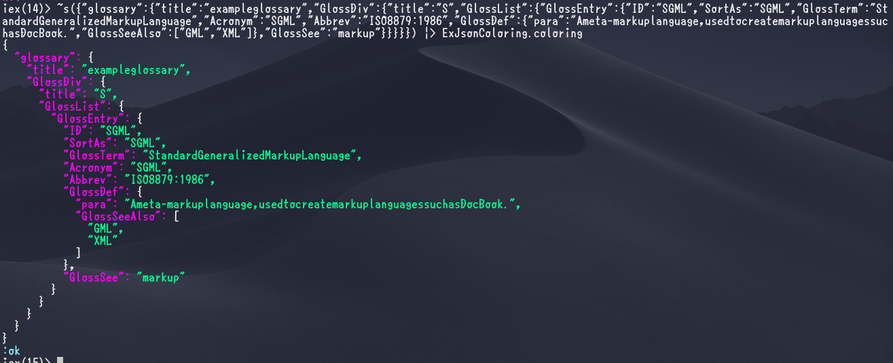

# ExJsonColoring

Syntax highlighting and Formating for JSON in Elixir



## Usage

```
iex> ExJsonColoring.coloring ~s({"key": "value"})
{
  "key": "value"
}
```

## Installation

If [available in Hex](https://hex.pm/docs/publish), the package can be installed
by adding `ex_json_coloring` to your list of dependencies in `mix.exs`:

```elixir
def deps do
  [
    {:ex_json_coloring, "~> 0.1.0"}
  ]
end
```

Documentation can be generated with [ExDoc](https://github.com/elixir-lang/ex_doc)
and published on [HexDocs](https://hexdocs.pm). Once published, the docs can
be found at [https://hexdocs.pm/ex_json_coloring](https://hexdocs.pm/ex_json_coloring).

